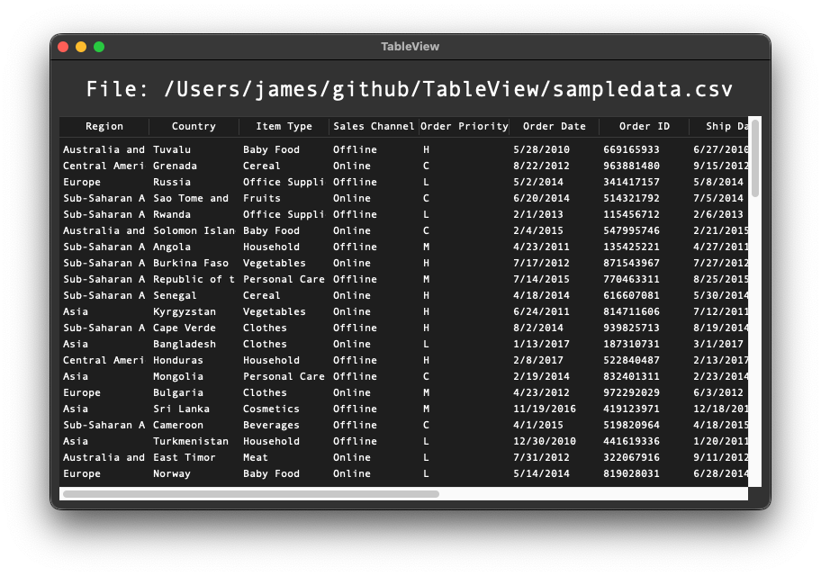

# TableView

A simple utility for macOS to load csv data from stdin or a file and render a nice interactive tableview to explore it.

[MIT license](License.txt)



## Build & Install

This was developed on macOS 12/13 using `Python 3.10.4` with tk installed via brew: `brew install python-tk`. 
If you do not install tk via brew, you will have a bad time.

Build the app with: `./build-app.sh`, then find `TableView.app` in `./dist/` 

Drag `TableView.app` into your Applications folder.

## Usage

Open the app, and it will prompt you to select a file ending in `.csv`

There are three ways to use it from terminal:
* pipe data to stdin: `cat sampledata.csv | /Applications/TableView.app/Contents/MacOS/TableView`
* read data from a file: `/Applications/TableView.app/Contents/MacOS/TableView sampledata.csv`
* use a file selection dialog: `/Applications/TableView.app/Contents/MacOS/TableView`


## Symlink
I like to throw a symlink my `~/bin/`
```bash
ln -s /Applications/TableView.app/Contents/MacOS/TableView ~/bin/tableview

# direct
tableview sampledata.csv

# stdin
cat sampledata.csv |tableview

# stdin alternate syntax
tableview < sampledata.csv
```

## STDIN Race Condition
What if I have a race condition with my stdin? 

Let's say you run a script which takes a few seconds before it spits out csv to stdout, and you pipe that into `tableview`.

```bash
# this script takes a few seconds before it prints a csv string
python3 get-lots-of-data.py |tableview
```

No problem! At first, the app will not find anything in stdin, so the filedialog will appear, 
just wait a few seconds to let your script finish, then hit "Cancel" button.

After you hit "Cancel" the app will check stdin again, and if it finds data it will re-exec itself with that data to stdin.

## Testing

For testing, you can build & run it all at once with `./run.sh sampledata.csv`

## Linux and other Unix-like systems

I only tested this on macOS, but this is all really basic python3 with tkinter, built into a macOS app using pyinstaller. It should be trivial to tweak it to work on any other system, and might already work out of the box.
