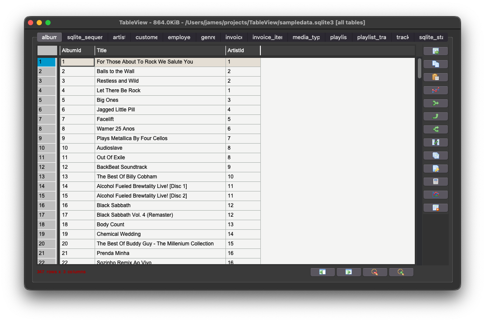

# TableView

[](License.txt)

A simple utility for macOS to load csv data from stdin or a file and render a nice interactive tableview to explore it.

From stdin, it presumes csv data. 

When a file is passed as an argument, several formats are supported, and the extension will be used guess the format.

supported filetypes:
* `.csv` comma-separated values
* `.tsv` tab-separated values
* `.xls` old MS Excel format
* `.xlsx` modern MS Excel format
* `.ods` OpenOffice / LibreOffice format
* `.sqlite3`, `.sqlite`, `.db` sqlite3 database

If you open it without any arguments or data, a dialog will let you select a file

I did not create much here, `pandastable.Table` does most of the work.



## Build & Install

This was developed on macOS 12/13 using `Python 3.10.4` with tk installed via brew: `brew install python-tk`. 
If you do not install tk via brew, you will have a bad time.

Build the app with: `./build-app.sh`, then find `TableView.app` in `./dist/` 

Drag `TableView.app` into your Applications folder.

## Usage

Open the app, and it will prompt you to select a file of a supported filetype.

There are three ways to use it from terminal:
* pipe data to stdin: `cat sampledata.csv | /Applications/TableView.app/Contents/MacOS/TableView`
* read data from a file: `/Applications/TableView.app/Contents/MacOS/TableView sampledata.csv`
* use the file selection dialog: `/Applications/TableView.app/Contents/MacOS/TableView`


## Symlink
I like to throw a symlink my `~/bin/`
```bash
ln -s /Applications/TableView.app/Contents/MacOS/TableView ~/bin/tableview

# when passing filename as argument, several file formats are supported
tableview sampledata.csv
tableview sampledata.tsv
tableview sampledata.xls
tableview sampledata.ods
tableview sampledata.xlsx # will load all sheets
tableview sampledata.xlsx sampledata # will load sheet named "sampledata"
tableview sampledata.xlsx 0  # will load first sheet (zero-indexed)
tableview sampledata.sqlite3  # load all tables
tableview sampledata.sqlite3 artists  # will load the table named "artists"
tableview sampledata.sqlite3 3  # will load the 4th table (zero-indexed)

# stdin assumes csv data
cat sampledata.csv |tableview

# stdin alternate syntax
tableview < sampledata.csv
```

## Testing

For testing, you can build & run it all at once with `./run.sh sampledata.csv`

You can also use `./test.sh sampledata.csv`, which just runs the python script without building the app.

## Linux and other Unix-like systems

I only tested this on macOS, but this is all really basic python3 with tkinter and pandas, built into a macOS app using pyinstaller. It should be trivial to tweak it to work on any other system, and might already work out of the box.
